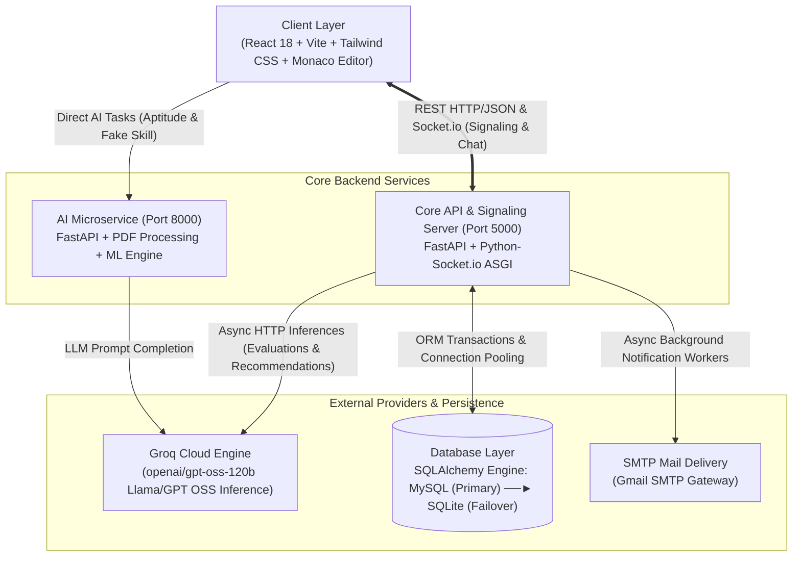
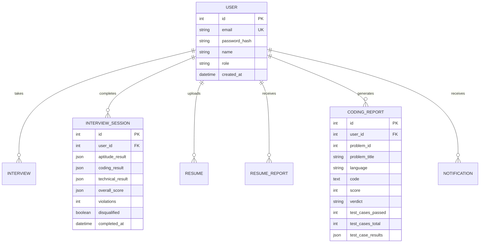
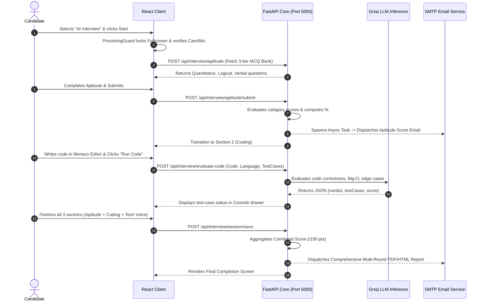

# 🏗️ System Architecture & Technology Stack Breakdown

This document details the architectural design, component interactions, database schemas, and the deep engineering rationale behind each technology choice in **SmartHire AI**.

---

## 1. High-Level Architecture

SmartHire AI utilizes a **decoupled, asynchronous microservice-oriented architecture** comprising three primary tiers:

---

## 2. Technology Stack & Strategic Rationale

In product-based company system design interviews, you must justify **why** a specific tool was chosen over industry alternatives:

### 🖥️ Frontend Tier
| Technology | Role | Why Chosen Over Alternatives? |
|---|---|---|
| **React 18** | UI Framework | Component-level state encapsulation, Virtual DOM efficiency during rapid proctoring re-renders, and mature hooks ecosystem (`useRef`, `useCallback`) essential for timer loops and WebRTC streaming. |
| **Vite** | Build Tool | Native ES modules provide sub-second hot module replacement (HMR) and optimized Rollup tree-shaking, vastly superior to legacy Webpack. |
| **Monaco Editor** | Code Editor | The exact VS Code engine in the browser; provides syntax highlighting, indentation, auto-closing brackets, and language server support without heavy third-party plugins. |
| **Tailwind CSS v4** | Design System | Zero-runtime CSS footprint, CSS variables design token integration, fluid dark/light theme switching with custom variants. |
| **Lucide Icons & Web Speech API** | Voice & UX | Native browser SpeechRecognition eliminates latency and cost of cloud speech APIs for real-time candidate vocal answers. |

---

### ⚙️ Backend Tier (Core API & Real-Time)
| Technology | Role | Why Chosen Over Alternatives? |
|---|---|---|
| **FastAPI (Python 3.11+)** | Core Web Framework | Async ASGI concurrency powered by `uvicorn` and `Starlette`. Automatic OpenAPI documentation, Pydantic type validation, and 300% faster throughput than traditional Flask/Django. |
| **Python-SocketIO** | Real-Time Engine | Provides ASGI-compliant bidirectional WebSocket communication for WebRTC signaling (SDP offer/answer exchange, ICE candidates), live interview chat, and proctoring telemetry. |
| **SQLAlchemy 2.0** | Object-Relational Mapper | Decouples business logic from raw SQL dialects. Enables **Zero-Downtime Dynamic Database Failover** (MySQL $\rightarrow$ SQLite). |
| **Groq Cloud API (`openai/gpt-oss-120b`)** | LLM Engine | LPUs (Language Processing Units) achieve inference speeds of **500+ tokens/sec**, enabling near-instant real-time code evaluation and voice conversation generation without candidate delay. |
| **`pdfplumber` + `io.BytesIO`** | In-Memory Document Parser | 100% in-memory byte stream extraction eliminates disk I/O bottlenecks and Windows file-locking race conditions during multi-file concurrent uploads. |

---

## 3. Database Architecture & Dynamic Failover Strategy

### Schema Entity Relationship

### 🛡️ Dynamic Database Failover Mechanism (`database.py`)
To prevent the application from crashing if the local/production MySQL instance is down or credentials fail:
1. `create_engine()` attempts a connection to `DATABASE_URL` (MySQL).
2. If an `OperationalError` or `ConnectionRefusedError` occurs, the exception is caught immediately.
3. The engine automatically switches to a local SQLite database (`smarthire.db`), synchronizes all tables via `Base.metadata.create_all()`, and logs a seamless fallback alert.
4. **Result:** 100% availability for developers, testers, and production staging environments.

---

## 4. End-to-End User Flow Sequence

